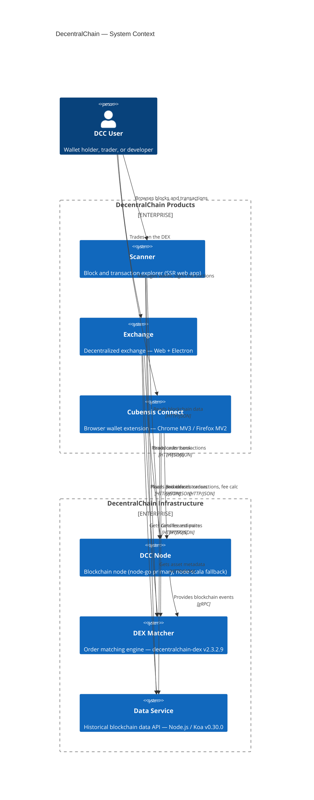
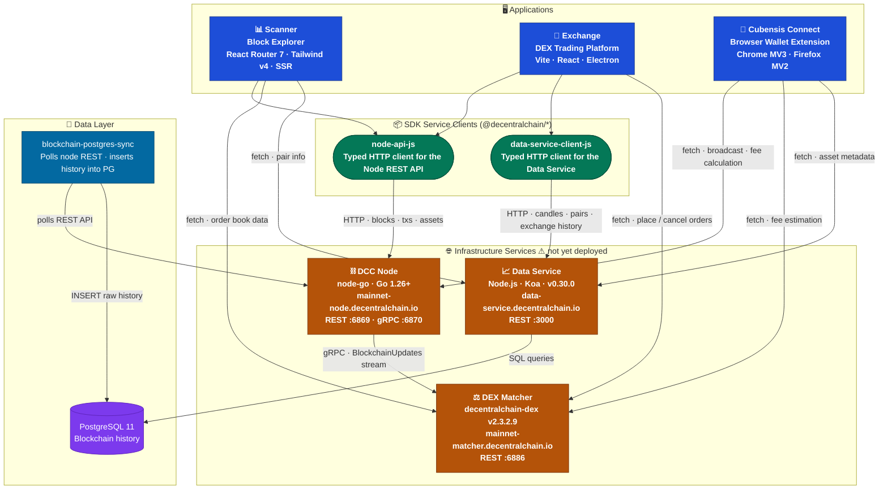
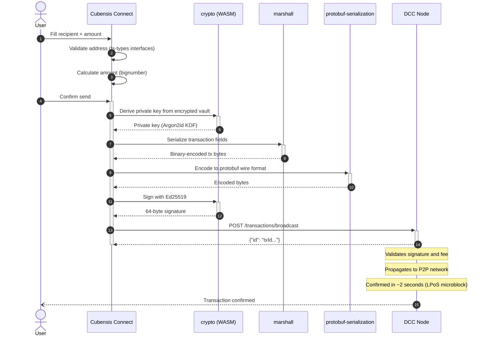
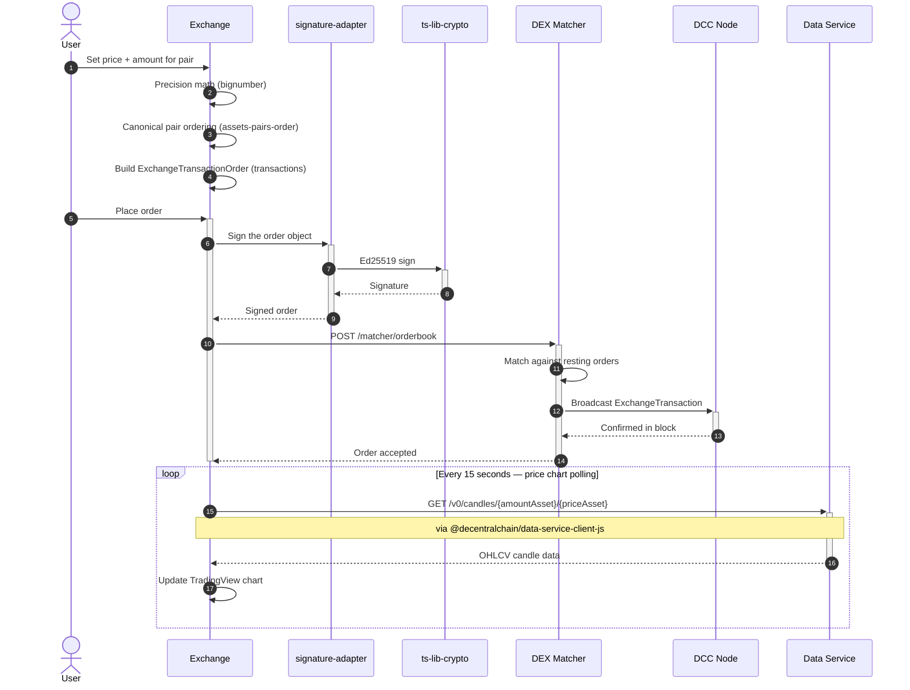
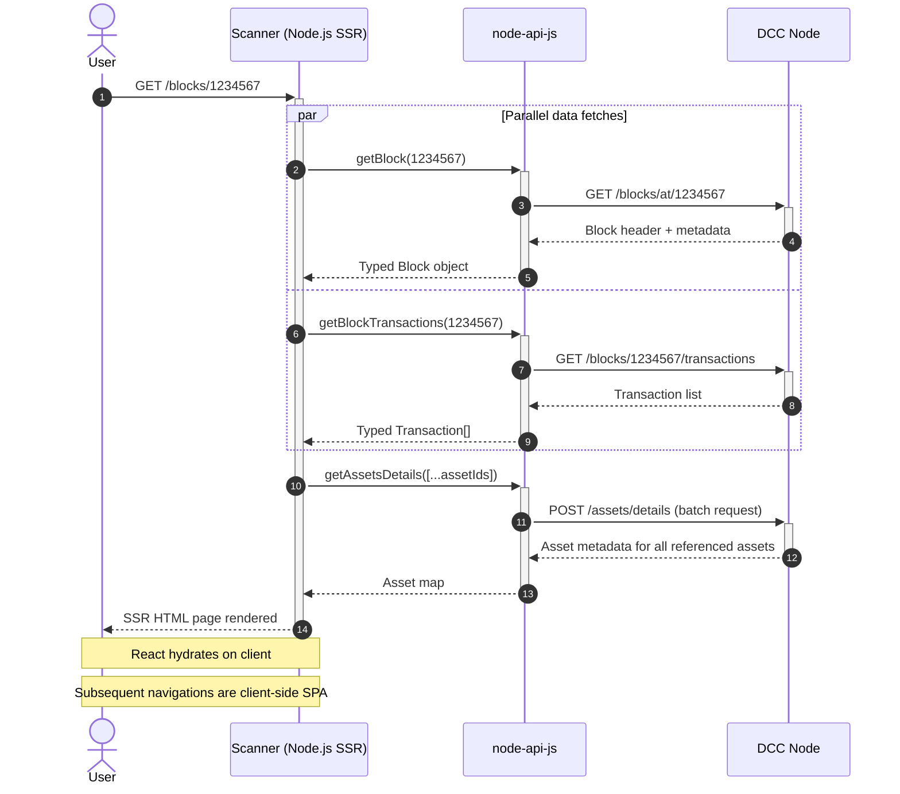
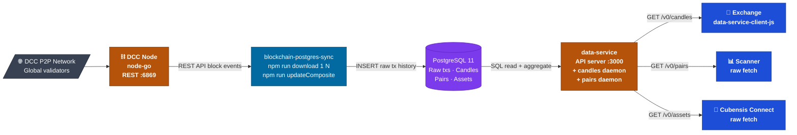
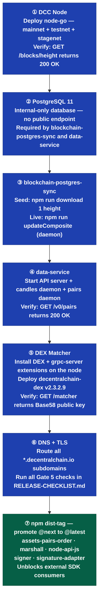

# Ecosystem Topology

> **Single-stop visual reference** for the complete DecentralChain ecosystem.
> Diagrams are the primary medium — follow the arrows.

---

## Navigation

| Diagram | What it answers |
|---------|----------------|
| [0. Master Diagram](#0-master-diagram--complete-ecosystem) | **Everything in one view** — all 22 packages, 3 apps, 4 services, full pipeline |
| [1. System Context](#1-system-context) | Who are the users and what systems exist? |
| [2. Runtime Topology](#2-runtime-topology--the-big-picture) | What talks to what over the network? |
| [3. SDK Package Architecture](#3-sdk-package-architecture) | How do the 22 library packages depend on each other? |
| [4. Flow: Send Transaction](#4-flow--send-a-transaction) | Step-by-step: user → wallet → node |
| [5. Flow: Place DEX Order](#5-flow--place-a-dex-order) | Step-by-step: user → exchange → matcher |
| [6. Flow: Browse the Explorer](#6-flow--browse-the-block-explorer) | Step-by-step: user → scanner → node |
| [7. Backend Data Chain](#7-backend-data-chain) | How does blockchain history reach the apps? |
| [8. Deployment Order](#8-deployment-order) | In what sequence must services be deployed? |
| [9. What Is Not Connected](#9-what-is-not-connected) | Services that exist but have no active consumer |
| [10. App ↔ SDK Reference](#10-app--sdk-reference) | Which SDK packages does each app use and why? |
| [11. Cross-References](#11-cross-references) | Links to related docs |

---

## 0. Master Diagram — Complete Ecosystem

Every node and every relationship in the system. 31 nodes · 64 arrows · nothing omitted.

| Arrow style | Meaning |
|---|---|
| `==>` thick | App directly imports this SDK package (`package.json` dependency) |
| `-->` normal | Intra-SDK dependency (one package depends on another) |
| `-.->` dashed | Direct `fetch` call — app hits the service with no SDK wrapper |
| `--\|label\|-->` labeled | Named protocol connection (HTTP, gRPC, SQL) |

```mermaid
%%{init: {'flowchart': {'defaultRenderer': 'elk'}}}%%
flowchart LR
    classDef app    fill:#1D4ED8,stroke:#1E3A8A,color:#fff,font-weight:bold
    classDef t0     fill:#134E4A,stroke:#0D3330,color:#fff
    classDef t1     fill:#0369A1,stroke:#0C4A6E,color:#fff
    classDef t2     fill:#6D28D9,stroke:#4C1D95,color:#fff
    classDef t3     fill:#B45309,stroke:#78350F,color:#fff
    classDef t4     fill:#991B1B,stroke:#7F1D1D,color:#fff
    classDef svc    fill:#D97706,stroke:#92400E,color:#fff,font-weight:bold
    classDef db     fill:#7C3AED,stroke:#5B21B6,color:#fff
    classDef ops    fill:#0284C7,stroke:#0369A1,color:#fff
    classDef net    fill:#374151,stroke:#111827,color:#fff
    classDef orphan fill:#4B5563,stroke:#374151,color:#9CA3AF,font-style:italic

    USER(("👤\nUser"))

    subgraph APPS["🖥  Applications  (3)"]
        direction TB
        SCANNER["📊 Scanner\nBlock Explorer\nReact Router 7 · SSR"]
        EXCHANGE["💱 Exchange\nDEX Platform\nVite · React · Electron"]
        CUBENSIS["🔐 Cubensis Connect\nWallet Extension\nChrome MV3 · Firefox MV2"]
    end

    subgraph SDK["📦  @decentralchain/* — 22 packages"]
        direction TB

        subgraph T4["Tier 4 · Providers"]
            CC_PROV["cubensis-connect-provider"]
        end

        subgraph T3["Tier 3 · Adapters"]
            direction LR
            SIG_ADAPT["signature-adapter"]
            SIGNER["signer"]
        end

        subgraph T2["Tier 2 · Integration"]
            direction LR
            TRANSACTIONS["transactions"]
            DS_CLI["data-service-client-js"]
        end

        subgraph T1["Tier 1 · Core"]
            direction LR
            DATA_ENT["data-entities"]
            M2N["money-like-to-node"]
            NODE_API["node-api-js"]
            RIDE["ride-js ⚠ orphan"]
        end

        subgraph T0["Tier 0 · Foundation  (zero internal deps)"]
            direction LR
            TS_TYPES["ts-types"]
            BIGNUMBER["bignumber"]
            TS_CRYPTO["ts-lib-crypto"]
            MARSHALL["marshall"]
            PROTOBUF["protobuf-serialization"]
            PARSE_BN["parse-json-bignumber"]
            BROWSER_BUS["browser-bus"]
            ORACLE["oracle-data"]
            ASSETS_PAIRS["assets-pairs-order"]
            LEDGER["ledger"]
            CRYPTO_WASM["crypto · WASM"]
            CC_TYPES["cubensis-connect-types"]
        end
    end

    subgraph INFRA["🌐  Infrastructure Services  ⚠ not yet deployed"]
        direction TB
        NODE_SVC["⛓️ DCC Node\nnode-go · Go 1.26+\nREST :6869 · gRPC :6870"]
        MATCHER_SVC["⚖️ DEX Matcher\ndecentralchain-dex v2.3.2.9\n:6886"]
        DATA_SVC["📈 Data Service\nNode.js · Koa · v0.30.0\n:3000"]
    end

    subgraph DATALAYER["💾  Data Layer"]
        direction TB
        P2P[/"🌐 P2P Network\nGlobal validators"/]
        BPS["blockchain-postgres-sync\npolls node · inserts history"]
        PG[("PostgreSQL 11\nblockchain history")]
    end

    %% ── User → Apps ───────────────────────────────────────────────────────
    USER --> SCANNER & EXCHANGE & CUBENSIS

    %% ── Scanner SDK imports (thick = direct package.json dep) ─────────────
    SCANNER ==> NODE_API

    %% ── Exchange SDK imports ──────────────────────────────────────────────
    EXCHANGE ==> NODE_API
    EXCHANGE ==> DS_CLI
    EXCHANGE ==> TRANSACTIONS
    EXCHANGE ==> SIG_ADAPT
    EXCHANGE ==> DATA_ENT
    EXCHANGE ==> ASSETS_PAIRS
    EXCHANGE ==> BIGNUMBER
    EXCHANGE ==> ORACLE
    EXCHANGE ==> BROWSER_BUS
    EXCHANGE ==> TS_CRYPTO

    %% ── Cubensis SDK imports ──────────────────────────────────────────────
    CUBENSIS ==> TS_TYPES
    CUBENSIS ==> BIGNUMBER
    CUBENSIS ==> CRYPTO_WASM
    CUBENSIS ==> DATA_ENT
    CUBENSIS ==> MARSHALL
    CUBENSIS ==> PARSE_BN
    CUBENSIS ==> PROTOBUF
    CUBENSIS ==> LEDGER
    CUBENSIS ==> CC_TYPES

    %% ── Intra-SDK: Tier 4 → lower ─────────────────────────────────────────
    CC_PROV --> CC_TYPES
    CC_PROV --> MARSHALL
    CC_PROV --> SIGNER

    %% ── Intra-SDK: Tier 3 → lower ─────────────────────────────────────────
    SIG_ADAPT --> BIGNUMBER
    SIG_ADAPT --> DATA_ENT
    SIG_ADAPT --> LEDGER
    SIG_ADAPT --> M2N
    SIG_ADAPT --> TRANSACTIONS
    SIG_ADAPT --> TS_TYPES
    SIGNER --> NODE_API
    SIGNER --> TS_CRYPTO
    SIGNER --> TS_TYPES
    SIGNER --> TRANSACTIONS

    %% ── Intra-SDK: Tier 2 → lower ─────────────────────────────────────────
    TRANSACTIONS --> MARSHALL
    TRANSACTIONS --> PROTOBUF
    TRANSACTIONS --> TS_CRYPTO
    TRANSACTIONS --> TS_TYPES
    DS_CLI --> BIGNUMBER
    DS_CLI --> DATA_ENT
    DS_CLI --> PARSE_BN

    %% ── Intra-SDK: Tier 1 → Tier 0 ────────────────────────────────────────
    DATA_ENT --> BIGNUMBER
    M2N --> TS_TYPES
    M2N --> BIGNUMBER
    M2N --> DATA_ENT
    NODE_API --> BIGNUMBER
    NODE_API --> TS_CRYPTO
    NODE_API --> TS_TYPES
    RIDE --> TS_CRYPTO

    %% ── SDK service clients → Infrastructure ──────────────────────────────
    NODE_API -->|"HTTP/JSON\nblocks · txs · assets"| NODE_SVC
    DS_CLI   -->|"HTTP/JSON\ncandles · pairs · history"| DATA_SVC

    %% ── Direct fetch calls (dashed = no SDK wrapper) ──────────────────────
    SCANNER  -.->|"pair info"| DATA_SVC
    SCANNER  -.->|"order book"| MATCHER_SVC
    EXCHANGE -.->|"place / cancel"| MATCHER_SVC
    CUBENSIS -.->|"broadcast"| NODE_SVC
    CUBENSIS -.->|"fee est."| MATCHER_SVC
    CUBENSIS -.->|"metadata"| DATA_SVC

    %% ── Service-to-service ────────────────────────────────────────────────
    NODE_SVC -->|"gRPC BlockchainUpdates"| MATCHER_SVC

    %% ── Data pipeline ─────────────────────────────────────────────────────
    P2P      --> NODE_SVC
    BPS      -->|"polls REST"| NODE_SVC
    BPS      -->|"INSERT"| PG
    DATA_SVC -->|"SQL"| PG

    class SCANNER,EXCHANGE,CUBENSIS app
    class CC_PROV t4
    class SIG_ADAPT,SIGNER t3
    class TRANSACTIONS,DS_CLI t2
    class DATA_ENT,M2N,NODE_API t1
    class RIDE orphan
    class TS_TYPES,BIGNUMBER,TS_CRYPTO,MARSHALL,PROTOBUF,PARSE_BN,BROWSER_BUS,ORACLE,ASSETS_PAIRS,LEDGER,CRYPTO_WASM,CC_TYPES t0
    class NODE_SVC,MATCHER_SVC,DATA_SVC svc
    class PG db
    class BPS ops
    class P2P net
```

> **Color legend:** 🔵 Blue = Apps · 🔴 Crimson = Tier 4 · 🟠 Amber = Tier 3 · 🟣 Purple = Tier 2 · 🔷 Steel = Tier 1 · 🟢 Teal = Tier 0 foundation · 🟡 Orange = Services · 💜 Violet = Database · 🔹 Sky = Ops tooling · ⬛ Grey = P2P Network · ◾ Dim = Orphaned package (`ride-js` — no app consumer)

---

## 1. System Context

Every actor, every product, every service, and every relationship — at 10,000 feet.

---

## 2. Runtime Topology — The Big Picture

Every network connection in the system. The SDK service-client packages (green) act as the typed bridge layer between apps and services.

> **Color legend:** Blue = apps · Green = SDK packages · Orange = infrastructure services · Purple = database · Teal = ops tooling

---

## 3. SDK Package Architecture

All 22 `@decentralchain/*` packages arranged by dependency tier. **Arrows point from dependent to dependency.** Tier 0 has no internal dependencies — it is the foundation everything else is built on.

```mermaid
flowchart TD
    classDef t0 fill:#0F766E,stroke:#134E4A,color:#fff
    classDef t1 fill:#0369A1,stroke:#0C4A6E,color:#fff
    classDef t2 fill:#7C3AED,stroke:#5B21B6,color:#fff
    classDef t3 fill:#B45309,stroke:#78350F,color:#fff
    classDef t4 fill:#B91C1C,stroke:#7F1D1D,color:#fff

    subgraph T4["Tier 4 — Providers"]
        CC_PROV["cubensis-connect-provider<br/>Bridges extension signing UI into external dApps"]
    end

    subgraph T3["Tier 3 — Adapters"]
        SIG_ADAPT["signature-adapter<br/>Seed · Ledger · Extension signing"]
        SIGNER["signer<br/>High-level signing orchestrator for dApps"]
    end

    subgraph T2["Tier 2 — Integration"]
        TRANSACTIONS["transactions<br/>Builds and serializes all 18 DCC transaction types"]
        DS_CLIENT["data-service-client-js<br/>HTTP client for historical data API"]
    end

    subgraph T1["Tier 1 — Core"]
        DATA_ENT["data-entities<br/>Money · Asset · OrderPair domain model"]
        M2N["money-like-to-node<br/>Converts domain objects to node API format"]
        NODE_API["node-api-js<br/>HTTP client for node REST API"]
        RIDE["ride-js<br/>RIDE smart contract compiler"]
    end

    subgraph T0["Tier 0 — Foundation  (zero internal dependencies)"]
        TS_TYPES["ts-types<br/>Core interfaces"]
        BIGNUMBER["bignumber<br/>Arbitrary-precision math"]
        TS_CRYPTO["ts-lib-crypto<br/>Ed25519 · Blake2b · SHA256"]
        MARSHALL["marshall<br/>Binary serialization"]
        PROTOBUF["protobuf-serialization<br/>Protobuf wire format"]
        PARSE_BN["parse-json-bignumber<br/>Precision-preserving JSON parse"]
        BROWSER_BUS["browser-bus<br/>Extension ↔ dApp postMessage IPC"]
        ORACLE["oracle-data<br/>Oracle price feed types"]
        ASSETS_PAIRS["assets-pairs-order<br/>Canonical DEX pair ordering"]
        LEDGER["ledger<br/>WebUSB APDU for Ledger hardware wallets"]
        CRYPTO_WASM["crypto (WASM)<br/>Rust/WASM key derivation · timing-safe HMAC"]
        CC_TYPES["cubensis-connect-types<br/>Wallet extension API interfaces"]
    end

    %% Tier 4 dependencies
    CC_PROV --> CC_TYPES
    CC_PROV --> MARSHALL
    CC_PROV --> SIGNER

    %% Tier 3 dependencies
    SIG_ADAPT --> BIGNUMBER
    SIG_ADAPT --> DATA_ENT
    SIG_ADAPT --> LEDGER
    SIG_ADAPT --> M2N
    SIG_ADAPT --> TRANSACTIONS
    SIG_ADAPT --> TS_TYPES
    SIGNER --> NODE_API
    SIGNER --> TS_CRYPTO
    SIGNER --> TS_TYPES
    SIGNER --> TRANSACTIONS

    %% Tier 2 dependencies
    TRANSACTIONS --> MARSHALL
    TRANSACTIONS --> PROTOBUF
    TRANSACTIONS --> TS_CRYPTO
    TRANSACTIONS --> TS_TYPES
    DS_CLIENT --> BIGNUMBER
    DS_CLIENT --> DATA_ENT
    DS_CLIENT --> PARSE_BN

    %% Tier 1 dependencies
    DATA_ENT --> BIGNUMBER
    M2N --> TS_TYPES
    M2N --> BIGNUMBER
    M2N --> DATA_ENT
    NODE_API --> BIGNUMBER
    NODE_API --> TS_CRYPTO
    NODE_API --> TS_TYPES
    RIDE --> TS_CRYPTO

    class CC_PROV t4
    class SIG_ADAPT,SIGNER t3
    class TRANSACTIONS,DS_CLIENT t2
    class DATA_ENT,M2N,NODE_API,RIDE t1
    class TS_TYPES,BIGNUMBER,TS_CRYPTO,MARSHALL,PROTOBUF,PARSE_BN,BROWSER_BUS,ORACLE,ASSETS_PAIRS,LEDGER,CRYPTO_WASM,CC_TYPES t0
```

> **Color legend:** Red = Tier 4 · Orange = Tier 3 · Purple = Tier 2 · Blue = Tier 1 · Teal = Tier 0 foundation

---

## 4. Flow — Send a Transaction

User clicks **Send** in Cubensis Connect.

---

## 5. Flow — Place a DEX Order

User clicks **Place Order** in the Exchange app.

---

## 6. Flow — Browse the Block Explorer

User navigates to `scanner.decentralchain.io/blocks/1234567`.

---

## 7. Backend Data Chain

How raw on-chain data becomes the candles, pairs, and asset metadata that apps consume.

> The three processes inside `data-service` (API server, candles daemon, pairs daemon) all share one PostgreSQL instance. The daemons pre-compute aggregates; the API server serves them on demand.

---

## 8. Deployment Order

**Every step is a hard prerequisite for the next.** Deploy in this exact sequence.

---

## 9. What Is Not Connected

Services that exist in the Decentral-America GitHub org but have **zero live consumers** in any current app.

| Service | Status |
|---------|--------|
| **DCCDataFeed** | No TypeScript app imports or fetches it. The Exchange TradingView chart polls the **data-service** directly via `data-service-client-js`, not DCCDataFeed. Not on the critical launch path. |
| **Identity API** (`id.decentralchain.io/api`) | Cognito + `amazon-cognito-identity-js` were fully removed (DCC-117/DCC-118). Zero identity API calls remain. |
| **BTC Gateway** (`btc.decentralchain.io`) | Referenced in `mainnet.json` gateway config but no active code path in the current exchange reaches it. |

### URL Discrepancy — Requires Resolution Before Gate 5

Two different data-service subdomains appear in the codebase. Both must route to the same backend:

| App | Data service URL in source |
|-----|---------------------------|
| Exchange | `https://data-service.decentralchain.io` (via `.env.production`) |
| Scanner | `https://data-service.decentralchain.io/v0` (via `src/lib/api.ts`) |
| **Cubensis Connect** | **`https://api.decentralchain.io`** (via `src/controllers/assetInfo.ts`) |

---

## 10. App ↔ SDK Reference

### Scanner (`apps/scanner`)

Block explorer. Read-only. No signing. One SDK dependency.

| Package | Why |
|---------|-----|
| `node-api-js` | Sole SDK dependency. All blockchain data — blocks, txs, addresses, assets, peers, rewards — comes through this typed HTTP client. |

### Exchange (`apps/exchange`)

DEX trading interface. Requires signing, order placement, price data, and asset metadata.

| Package | Why |
|---------|-----|
| `node-api-js` | Balance queries, transaction broadcast to node |
| `data-service-client-js` | OHLCV candles (TradingView chart), exchange tx history, asset pairs, asset metadata |
| `transactions` | Builds ExchangeTransaction, InvokeScriptTransaction, TransferTransaction |
| `signature-adapter` | Signs with whichever provider is active: seed phrase, Ledger, or wallet extension |
| `data-entities` | Money and Asset domain model — price display, amount formatting |
| `assets-pairs-order` | Canonical ordering of asset pairs in the order book |
| `bignumber` | Precision arithmetic for prices and amounts |
| `oracle-data` | Reads oracle price feeds from the blockchain |
| `browser-bus` | Extension ↔ dApp cross-window postMessage when the wallet extension is active |
| `ts-lib-crypto` | Address validation and key utilities |

### Cubensis Connect (`apps/cubensis-connect`)

Browser wallet extension. Key management, signing UI, swap UI, Ledger hardware wallet support.

| Package | Kind | Why |
|---------|------|-----|
| `ts-types` | Runtime | Core domain type interfaces used throughout |
| `bignumber` | Runtime | Amount arithmetic |
| `crypto` (WASM) | Runtime | Rust/WASM key derivation, timing-safe HMAC, Ed25519 signing |
| `data-entities` | Runtime | Money/Asset model for balance display |
| `marshall` | Runtime | Binary tx field serialization |
| `parse-json-bignumber` | Runtime | Safe JSON parsing for node API responses |
| `protobuf-serialization` | Runtime | Protobuf tx serialization for broadcast |
| `ledger` | Build (devDep) | Ledger hardware wallet support via WebUSB APDU — compiled into extension bundle |

---

## 11. Cross-References

| Topic | Document |
|-------|---------|
| SDK package inventory + upstream Waves provenance | [UPSTREAM.md](UPSTREAM.md) |
| Per-package health and remediation status | [STATUS.md](STATUS.md) |
| Monorepo toolchain (Nx, pnpm, tier conventions) | [ARCHITECTURE.md](ARCHITECTURE.md) |
| Coding standards and quality pipeline | [CONVENTIONS.md](CONVENTIONS.md) |
| Release gate checklist and Go/No-Go criteria | [RELEASE-CHECKLIST.md](RELEASE-CHECKLIST.md) |
| Open production work items | [PROD-READINESS-TODO.md](PROD-READINESS-TODO.md) |
| node-go status and 20-audit history | [node-go README](../../../node-go/README.md) |

---

*Last updated: 2026-03-31 — derived from package.json dependency audits, Legacy codebase analysis, and backend repo research across `Decentral-America/matcher`, `Decentral-America/data-service`, `Decentral-America/blockchain-postgres-sync`, and `Decentral-America/DCCDataFeed`.*
